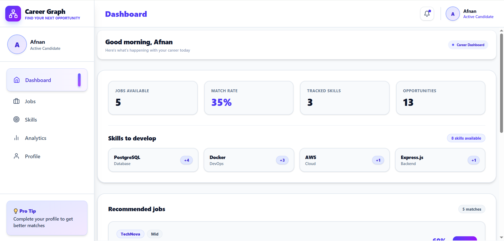
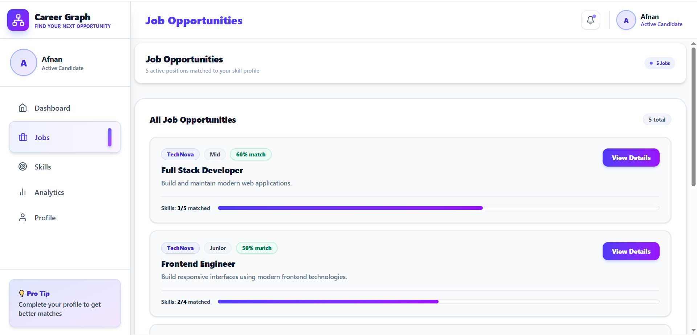
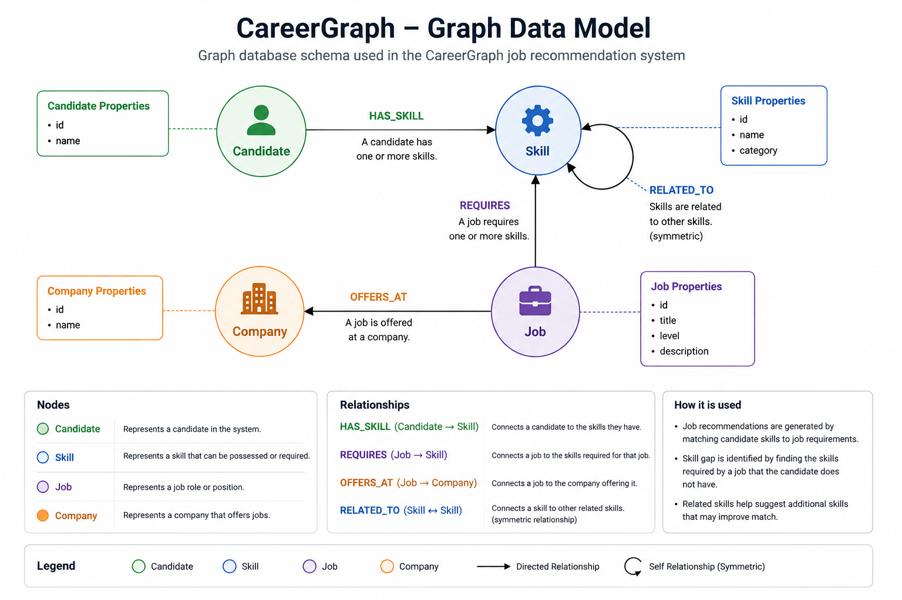

# CareerGraph

CareerGraph is a graph-powered job recommendation application built for the Wexa AI CognoDB take-home assignment.

It helps candidates discover job opportunities based on their current skills and identify the skills they are missing for a specific role.

## Live Demo

**Frontend:** https://wexa-careergraph.netlify.app/

**Backend:** https://careergraph-api-iptg.onrender.com

**GitHub:** https://github.com/afnanalzaidi/wexa-fullstack-assessment.git

---

## Features

* Job recommendations based on candidate skills
* Match percentage for each job
* Skill-gap analysis for individual jobs
* Related-skill exploration
* Graph-based data modeling and queries
* Responsive React + Tailwind UI
* Loading and error states
* Seed script for realistic graph data

---

## Why a Graph Database?

Career recommendations are based on relationships between candidates, skills, jobs, and companies.

A relational database could store these entities, but queries involving multiple relationships become more complex as the recommendation logic grows.

With a graph database, these relationships are represented directly:

```text
Candidate ──HAS_SKILL──> Skill
Job ──REQUIRES──> Skill
Job ──OFFERS_AT──> Company
Skill ──RELATED_TO──> Skill
```

This makes multi-hop traversal and relationship-based recommendations natural to query using Cypher.

---

## Graph Data Model

```text
Candidate
   │
   │ HAS_SKILL
   ▼
 Skill ──RELATED_TO──> Skill
   ▲
   │ REQUIRES
   │
  Job
   │
   │ OFFERS_AT
   ▼
Company
```

### Main Nodes

* `Candidate`
* `Skill`
* `Job`
* `Company`

### Main Relationships

* `HAS_SKILL`
* `REQUIRES`
* `RELATED_TO`
* `OFFERS_AT`

---

## Technology Stack

**Frontend**

* React
* Vite
* Tailwind CSS

**Backend**

* Node.js
* Express
* Neo4j JavaScript Driver

**Database**

* CognoDB
* openCypher
* Bolt protocol

**Deployment**

* Netlify — frontend
* Render — backend

---

## Project Structure

```text
wexa-cognodb-app/
│
├── client/              # React frontend
├── server/              # Express backend
├── scripts/             # Database seed/query scripts
├── cypher/              # Cypher queries
└── README.md
```

---

## Setup

### 1. Clone the repository

```bash
git clone https://github.com/afnanalzaidi/wexa-fullstack-assessment.git
cd wexa-cognodb-app
```

### 2. Configure the backend

Create:

```text
server/.env
```

Add:

```env
COGNODB_URI=uri
COGNODB_USERNAME=cognodb
COGNODB_PASSWORD=congobdpasword
```

### 3. Install dependencies

```bash
cd server
npm install

cd ../client
npm install
```

### 4. Seed the database

From the project root:

```bash
node scripts/seed.js
```

This creates the CareerGraph sample data and relationships in CognoDB.

### 5. Start the backend

```bash
cd server
npm run dev
```

The backend runs locally on:

```text
http://localhost:5000
```

### 6. Start the frontend

In another terminal:

```bash
cd client
npm run dev
```

---

## Key Graph Queries

### Job Matching

Finds jobs based on the candidate's existing skills and calculates a match percentage.

```text
Candidate → HAS_SKILL → Skill
Job → REQUIRES → Skill
```

### Skill Gap

Finds the skills required by a job that the candidate does not currently have.

```text
Candidate → HAS_SKILL → Skill
Job → REQUIRES → Skill
```

### Related Skills

Explores relationships between skills to identify additional skills that may be useful.

```text
Skill → RELATED_TO → Skill
```

The full Cypher queries are available in:

```text
cypher/
```

---

## Screenshots

### Dashboard



### Job Details / Skill Gap



### Skills


---

## Graph Data Model (Daigram)



## Environment Variables

Database credentials are stored in environment variables and are not committed to the repository.

See:

```text
server/.env.example
```

for the required variables.

---

## Author

**Afnan Al Zaidi**

Built as a take-home assignment for **Wexa AI**.
